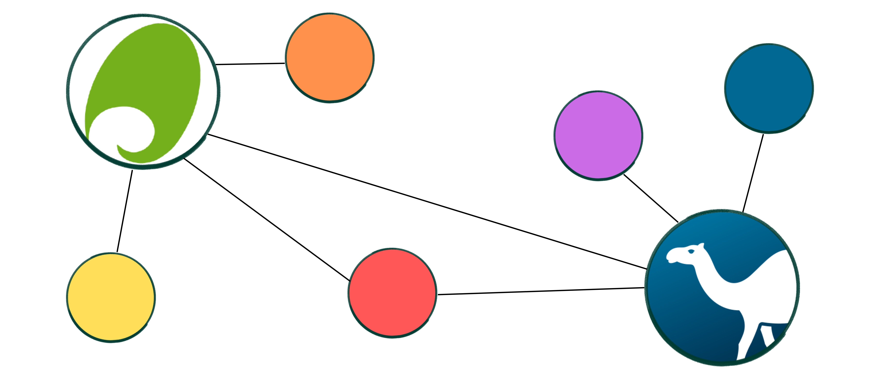
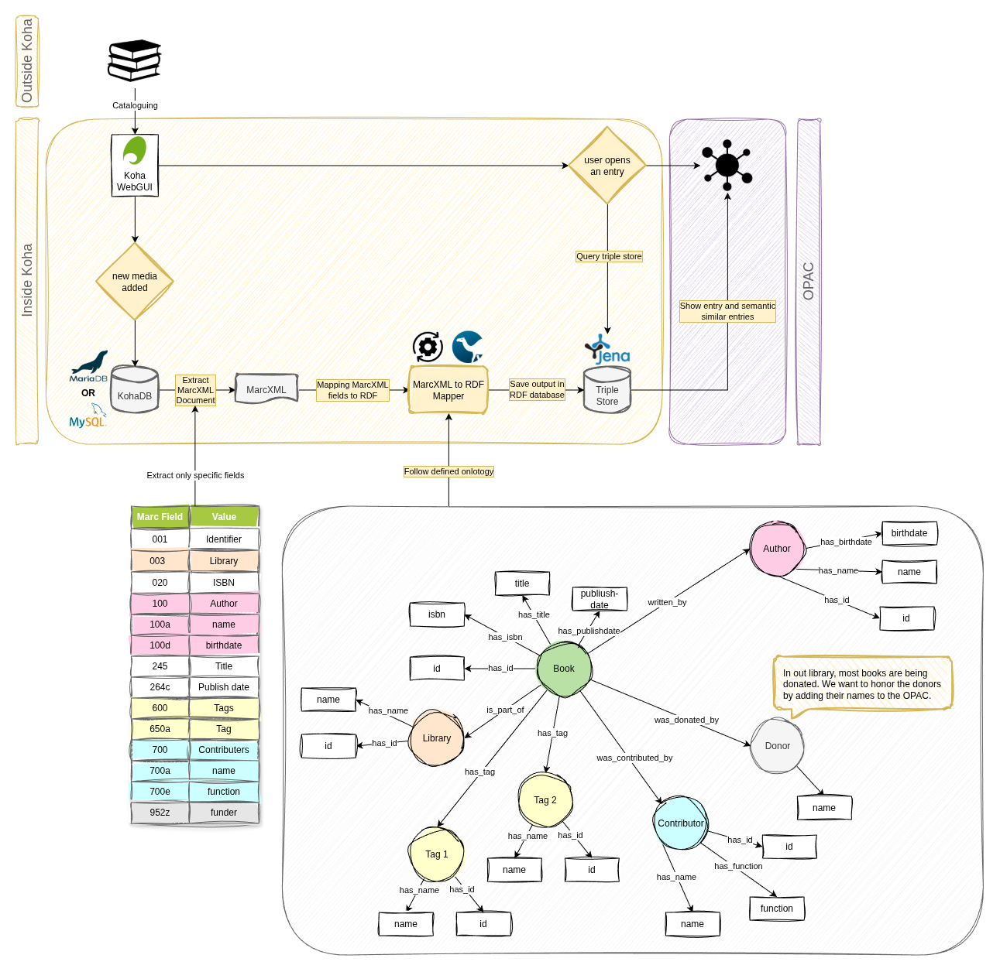

# KohaLens

 

This small university project began at the Technical University of Applied Sciences Wildau, Germany, and is now being developed further at the Library of Crafts in Berlin, Germany.

Idea: Parse our MarcXML data into RDF (Turtle) and save the triplets in an Apache Jena Fuseki database. Then visualise the data as a knowledge graph.

My goal is to create a Koha plugin that can easily convert MARC XML to Turtle format and integrate with the OPAC natively, particularly for use in small libraries.

Feel free to leave a message and commit :)

## Current Workflow

## How-To

This is a really messy 'how to'! We're still working on documenting our processes in a way that is both understandable and attractive.

--> 
